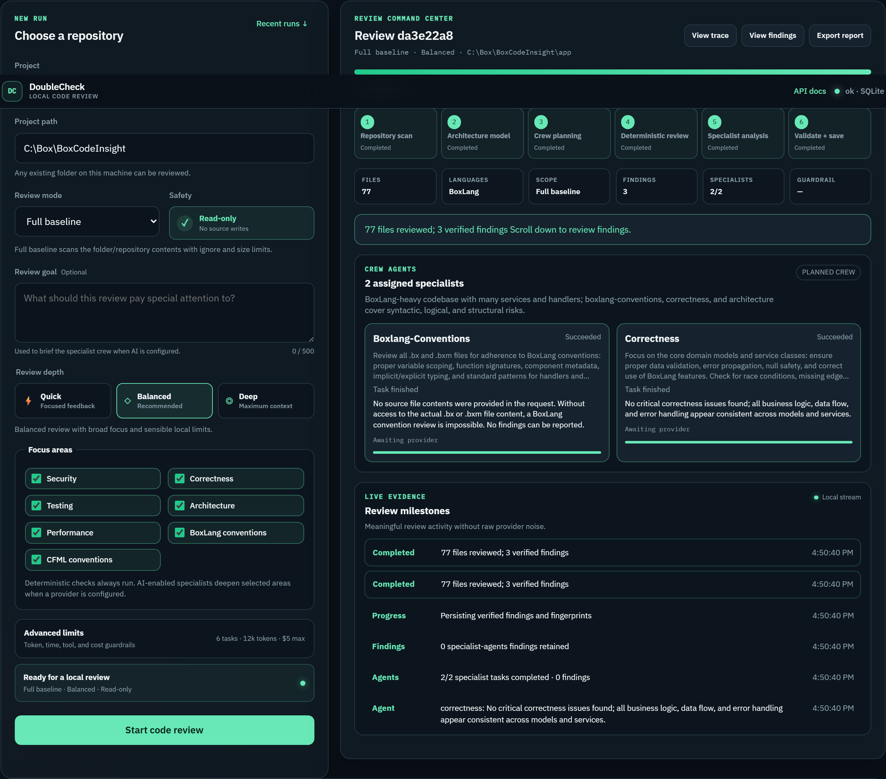
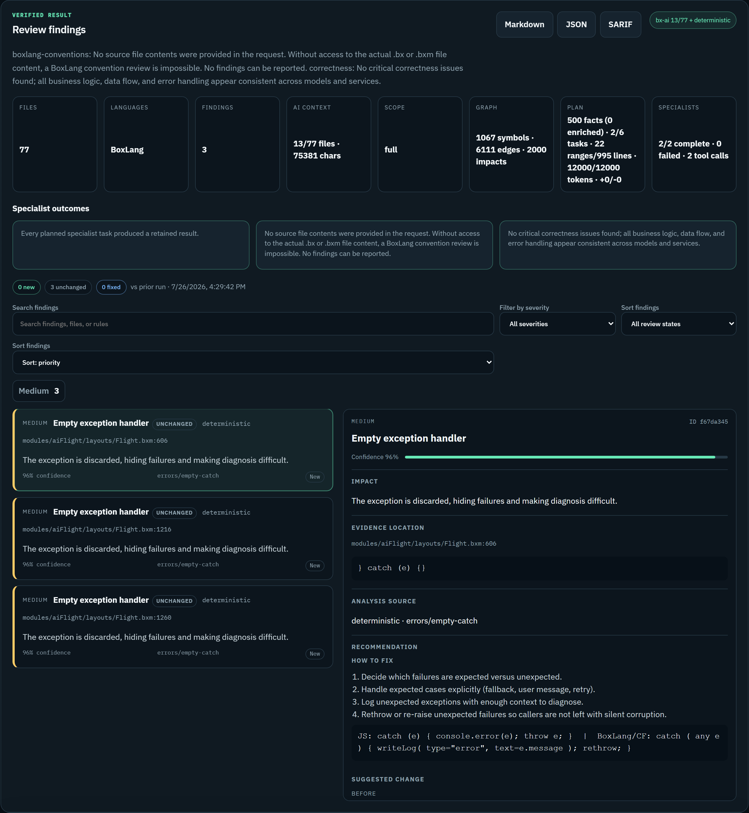
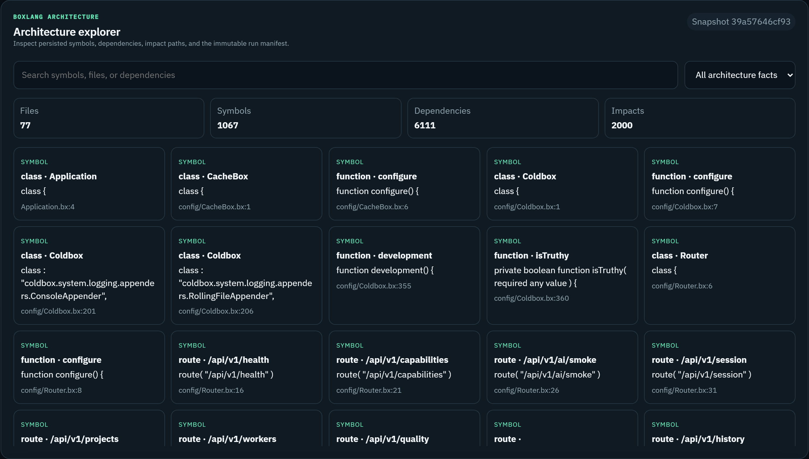
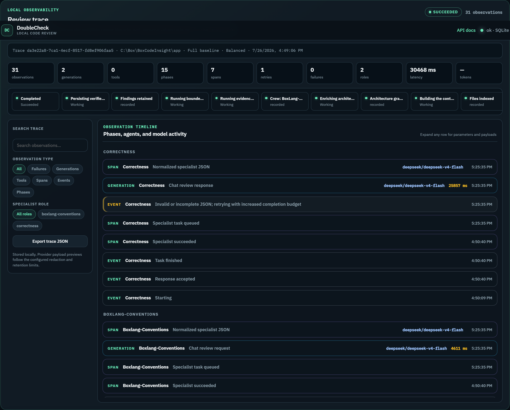

# DoubleCheck

**Local second pair of eyes** for **BoxLang**, **ColdFusion**, **JavaScript**, and **Java**.

Runs on your machine with SQLite — not SaaS, not hosted, not multi-tenant. A desktop helper beside Cursor (or similar): point at a repo, review with evidence, optional AI specialists when you want depth.

[](#quick-start)
[](#quick-start)
[](#supported-languages)
[](#configuration)

> Basic review works **without an AI key**. Deterministic checks always run; LLM specialists deepen selected areas when a provider is configured.

## What it is

DoubleCheck is a local desktop code review assistant for BoxLang, ColdFusion,
JavaScript, and Java. It uses Git to scope reviews (working tree, revision range,
or full repository), indexes source files, runs deterministic checks without an
AI key, and optionally sends bounded context to configurable LLM specialist
agents with read-only tools. It produces structured, line-level findings with
evidence and export to Markdown, JSON, or SARIF. For unfamiliar codebases or
when there is no meaningful diff, **full** mode reviews entire supported
directories on disk.

Git scopes which files to review; the pipeline indexes full source contents, not
unified diff patches.

## Core approach

DoubleCheck runs deterministic engineering first — indexing, parsing,
architecture facts, rule-based checks, and evidence validation — then optionally
layers bounded specialist agents on top for deeper semantic review. The agent
proposes; deterministic gates verify. Basic review works without AI; agents
deepen selected areas when configured.

---

## What you get

1. **Evidence-backed local review** while you generate or refactor
2. **Legacy ColdFusion modernization assist** — guidance, not an auto-migrator
3. **Honest capability claims** — measured labels, one clear path per feature

---

## Product tour

### Workspace — start a review

Choose a folder, set depth and focus areas, keep the run **read-only**, then watch the command center through scan → architecture → specialists → validate.



### Findings — inspect and act

Verified findings with severity, confidence, evidence snippets, and fix guidance. Export **Markdown**, **JSON**, or **SARIF**.



### Architecture — explore the graph

For BoxLang projects, browse persisted symbols, dependencies, and impact paths from the run snapshot.



### Observability — follow the flight

Local traces for phases, specialist roles, generations, tool calls, and retries — useful when tuning models or debugging a run.



---

## Supported languages

| Language | Status |
|---|---|
| BoxLang | Deepest — graph, architecture, measured tier |
| ColdFusion (CFML) | Graph, architecture, and deterministic rules without a key; LLM depth when an AI key is set |
| JavaScript | In scope; lighter depth today |
| Java | In scope; lighter depth today |

No other languages are product targets.

---

## Quick start

### Option 1: With CommandBox (Recommended for Developers)

**Requirements:** [CommandBox](https://commandbox.ortusbooks.com/) 6+ and a BoxLang-capable server (runtime modules such as `bx-ai` / `bx-sqlite` install on first start).

```powershell
box install
box run-script setup
# Optional — set OPENAI_API_KEY in .env for LLM specialists
box server start --console
```

`setup` only creates `.env` if missing. On first start the app creates the SQLite file and schema when needed.

`--console` keeps the server in the foreground and prints the bind URL (commonly `http://127.0.0.1:55452`). Open that URL for the workspace.

### Option 2: No CommandBox (Standalone - JDK 21 Only)

**Requirements:** JDK 21 or higher (Java runtime only — no other tools needed).

**Windows:**
```batch
.\startup.bat
```

**macOS/Linux:**
```bash
bash startup.sh
```

The app launches on `http://localhost:8585` and opens your browser automatically. First run creates `.env` from `.env.example` and initializes the database.

**Flags (both platforms):**
```bash
# Custom port
startup.bat --port 9000

# Don't open browser
startup.sh --no-browser

# Enable debug logging
startup.sh --debug

# Show help
startup.sh --help
```

**All features work without CommandBox:**
- ✓ Full UI and workspace
- ✓ Code review and analysis
- ✓ Basic findings (deterministic)
- ✓ AI specialists (optional — add `OPENAI_API_KEY` to `.env`)

#### Java Setup (if needed)

If you get "Java is not recognized", set up Java with one of these approaches:

**Option A: Add Java to PATH (Recommended)**
1. Install [JDK 21](https://www.oracle.com/java/technologies/downloads/)
2. Add `C:\Program Files\Java\jdk-21.X.X\bin` to your system PATH
3. Restart your terminal or IDE
4. Run `startup.bat` or `startup.sh`

**Option B: Set JAVA_HOME Environment Variable**
```powershell
# Windows (PowerShell)
[Environment]::SetEnvironmentVariable("JAVA_HOME", "C:\Program Files\Java\jdk-21.X.X", "User")
```

```bash
# macOS/Linux (add to ~/.bashrc or ~/.zshrc)
export JAVA_HOME=/Library/Java/JavaVirtualMachines/openjdk-21.X.X/Contents/Home
```

Then restart your terminal and run the startup script.

**Option C: Install Java with Package Manager**
```bash
# macOS (Homebrew)
brew install openjdk@21

# Linux (Ubuntu/Debian)
sudo apt-get update
sudo apt-get install openjdk-21-jdk
```

| Resource | Path |
|---|---|
| Workspace | `/` (URL printed by CommandBox) |
| AiFlight (bx-ai traces) | `/aiflight/` |
| API docs (Swagger UI) | `/apidocs/` |
| OpenAPI JSON | `/api/v1/openapi.json` |
| OpenAPI YAML | `/api/v1/openapi.yaml` |

---

## Running tests

**With CommandBox:**
```powershell
box testbox run
```

**Standalone (JDK 21 only, no CommandBox):**
```batch
REM Windows
.\test.bat
```
```bash
# macOS/Linux
./test.sh
```

Both start the miniserver, run the full TestBox suite, print TestBox's plain-text
`Final Stats` summary (`[Passed: N] [Failed: N] [Errors: N]`), exit non-zero on
any failure, and always stop the server before returning — no server is left
running afterward. Flags: `--json`, `--junit`, `--tap`, `--html` for other report
formats, `--verbose` for server startup detail.

To browse results interactively instead, start the app (`startup.bat` /
`startup.sh`) and open `http://localhost:8585/tests/runner.bxm`. The richer
`/tests/index.bxm` TestBox Run IDE (with its own CSS/JS) does not render
correctly under the standalone miniserver — its static assets 404/500 because
of how miniserver rewrites unmatched paths to `index.bxm`. `runner.bxm` is
unaffected and is what `test.bat`/`test.sh` use.

---

## Configuration

Copy [`.env.example`](.env.example). Important keys:

| Variable | Purpose |
|---|---|
| `DOUBLECHECK_DB_PATH` | SQLite path (default `./.db/doublecheck.db`) |
| `OPENAI_API_BASE` / `OPENAI_API_KEY` / `DEFAULT_MODEL` | LLM specialists (optional for basic review) |

Local-only: no auth, tenants, or hosted production mode.

### Scan and LLM budgets

| Variable | Default | Role |
|---|---|---|
| `DOUBLECHECK_SCAN_MAX_FILE_BYTES` | `524288` | Skip a single file if larger (scan gate, not LLM) |
| `DOUBLECHECK_SCAN_MAX_BYTES` | `10485760` | Total indexed bytes |
| `DOUBLECHECK_SCAN_MAX_FILES` | `250` | Max indexed files |
| `AI_CONTEXT_WINDOW` | local `8192` / cloud `128000` | Model context window |
| `DOUBLECHECK_PLAN_MAX_CONTEXT_CHARACTERS` | `30000` | Specialist context-pack budget |

Raising scan limits indexes more source for deterministic rules. Specialists still receive bounded context packs; raise plan/token/`AI_CONTEXT_WINDOW` knobs separately if prompts hit context errors.

---

## Live review loop

While editing, run a lightweight watcher that queues a fast, deterministic-only
review (crew planning and specialist agents skipped) on every save:

```powershell
pwsh tools/watch-review.ps1 -ProjectPath C:\path\to\your\project
```

Findings print to the terminal a few seconds after each save. This calls the
same local `POST /api/v1/runs` endpoint as the workspace UI with
`mode: "working-tree", fast: true` — no separate server or subsystem. Run a
normal (non-fast) review from the workspace UI for full specialist depth.

---

## Layout

```text
app/                      ColdBox application
public/                   Web root + desktop UI
resources/database/       Migrations
resources/docs/images/    README screenshots
.db/                      SQLite (gitignored)
tests/                    TestBox
```

---

## Contributing

Prefer small, testable changes for **BoxLang, ColdFusion, JavaScript, or Java** only.

Do **not** add SaaS, hosted multi-tenant architecture, login walls, or mobile UI layouts.

Agent guidance: [`AGENTS.md`](AGENTS.md) and `.cursor/rules/`.
