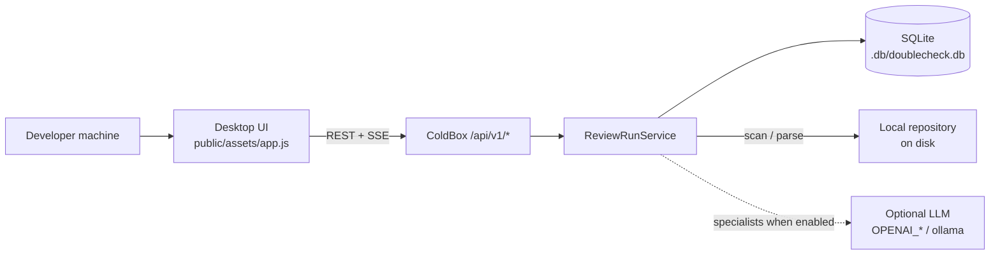
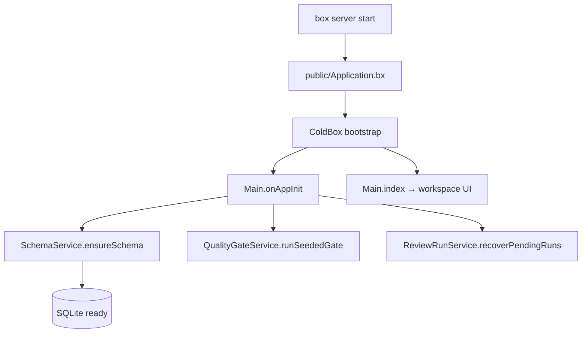
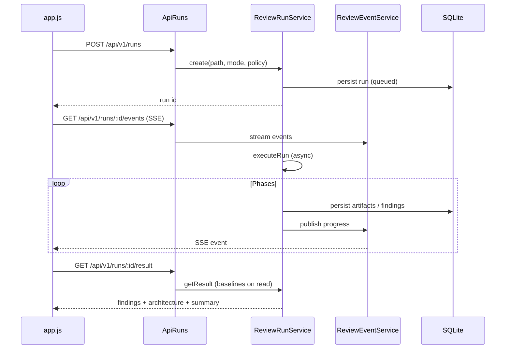
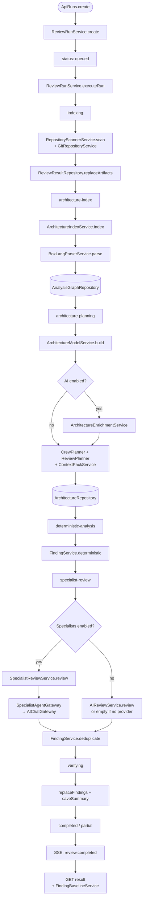
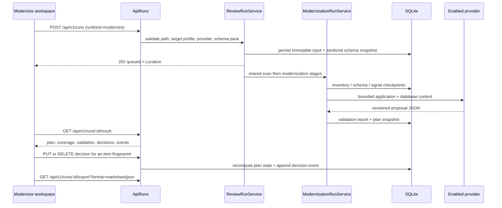
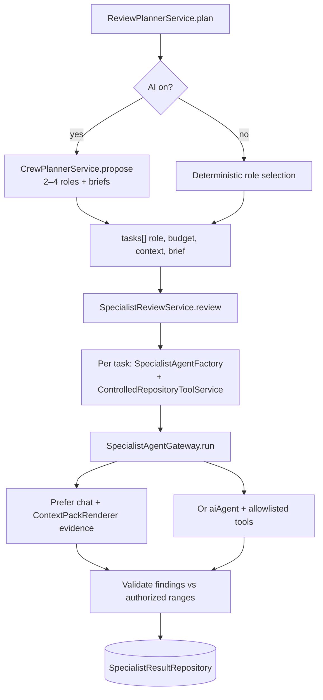
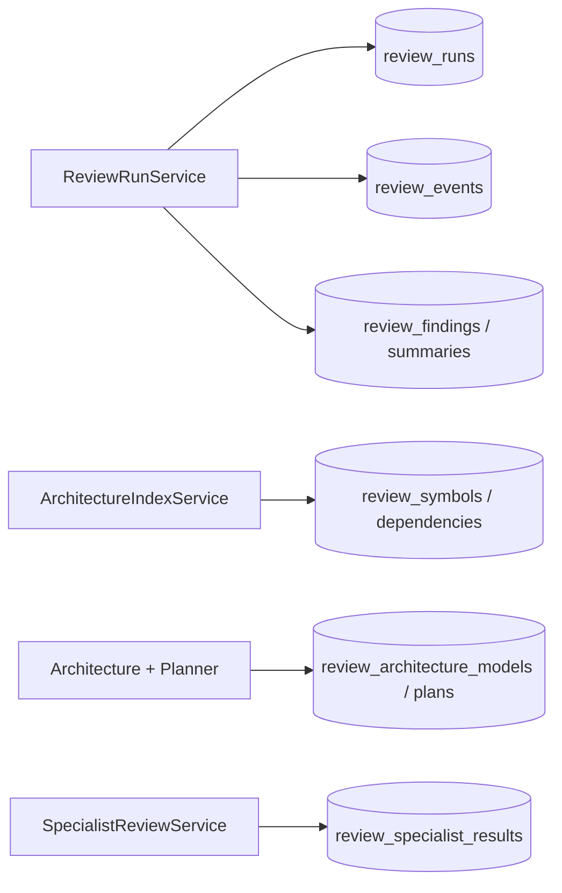

# DoubleCheck — technical implementation & project flow

Local desktop review and modernization helper for **BoxLang, ColdFusion,
JavaScript, and Java**. Analysis and SQLite run on the developer’s machine.
LLM specialists are optional for Review; Modernize requires an enabled provider.

This document describes how the system is wired. Install and product summary live in
[`readme.md`](../../readme.md). OpenAPI lives under [`resources/apidocs/`](../apidocs/).

---

## Product summary

DoubleCheck is a local desktop code review assistant for BoxLang, ColdFusion,
JavaScript, and Java. It uses Git to scope reviews (`working-tree`,
`revision-diff`, or `full`), indexes source files, runs deterministic checks
without an AI key, and optionally sends bounded context to configurable LLM
specialist agents with read-only tools. It produces structured, line-level
findings with evidence and export to Markdown, JSON, or SARIF. For unfamiliar
codebases or when there is no meaningful diff, **full** mode reviews entire
supported directories on disk.

Git scopes which files to review; the pipeline indexes full source contents, not
unified diff patches.

## Core approach

DoubleCheck runs deterministic engineering first — indexing, parsing,
architecture facts, rule-based checks, and evidence validation — then optionally
layers bounded specialist agents on top for deeper semantic review. The agent
proposes; deterministic gates verify. Basic review works without AI; agents
deepen selected areas when configured.

| Layer | Deterministic engineering | Agent / LLM (optional) |
|---|---|---|
| Discovery | Git scoping, file indexing, language filtering | — |
| Structure | BoxLang parser, dependency graph, architecture facts | Optional fact enrichment with citation checks |
| Planning | Role selection, budgets, context packs, policy | Optional crew planner (roles + briefs) |
| Findings | High-confidence rules (secrets, SQL interpolation, …) | Semantic review by specialist role |
| Trust | Evidence must match indexed source; authorized spans; fingerprints | Proposes candidates; must pass deterministic validation |

---

## Mental model

```text
Browser UI (public/assets/app.js)
        │  REST + SSE
        ▼
ColdBox handlers (app/handlers/Api*.bx)
        │
        ▼
ReviewRunService          ← orchestrates one run end-to-end
        │
        ├─ RepositoryScannerService / GitRepositoryService
        ├─ ArchitectureIndexService → BoxLangParserService → graph DB
        ├─ ArchitectureModelService (+ optional Enrichment)
        ├─ CrewPlannerService (LLM roles + briefs when AI on)
        ├─ ReviewPlannerService + ContextPackService
        ├─ FindingService (deterministic)
        ├─ FindingSolutionService + RulePlaybookCatalog
        ├─ SpecialistReviewService → SpecialistAgentGateway → AIChatGateway
        ├─ AIReviewService (fallback if specialists off)
        └─ FindingBaselineService (compare to prior run on read)
        │
        ▼
Repositories (SQLite under DOUBLECHECK_DB_PATH)
        │
        ▼
SSE events (ReviewEventService) → UI live panel
```

**Rule of thumb:** handlers stay thin; review logic lives under
`app/models/services/`. Persistence is `app/models/repositories/`.

---

## System context



---

## Bootstrap & layout

| Step | Where |
|---|---|
| Web root | `public/` → `public/Application.bx` maps `/app` |
| App shield | `app/Application.bx` is `abort;` (blocks direct web access to `/app`) |
| ColdBox config | `app/config/ColdBox.bx` (settings from `.env`) |
| Routes | `app/config/Router.bx` |
| App start | `Main.onAppInit` → `SchemaService.ensureSchema()`, quality gate, recover pending runs |
| Setup CLI | `Setup.bx` creates `.env` only when missing (does not create the DB) |
| UI page | `Main.index` → `app/views/main/index.bxm` + `public/assets/app.js` / `app.css` |



### Folder map

```text
app/
  handlers/           HTTP adapters (ApiRuns, ApiHealth, …)
  models/
    services/         Business logic (start here for features)
    repositories/     SQLite access
    domain/           Small domain objects
  views/              Server-rendered UI shells
  config/             ColdBox + Router
  modules/aiFlight/   Optional bx-ai trace explorer (separate DB)
public/
  assets/app.js       Workspace UI + SSE client
  assets/app.css
resources/
  database/           Migrations
  apidocs/            OpenAPI source
  docs/               This documentation
tests/specs/          TestBox (unit + integration)
```

---

## HTTP surface

Defined in `app/config/Router.bx`.

| Method | Path | Handler | Role |
|---|---|---|---|
| GET | `/api/v1/health` | ApiHealth | Liveness |
| GET | `/api/v1/capabilities` | ApiCapabilities | Feature flags for UI |
| GET | `/api/v1/session` | ApiSession | Local session / principal |
| GET | `/api/v1/projects` | ApiProjects | Local project list |
| GET | `/api/v1/workers` | ApiWorkers | Worker registry |
| GET | `/api/v1/quality` | ApiQuality | Seeded evaluation gate |
| GET | `/api/v1/history` | ApiHistory | Review + Modernize history (`runKind` filter) |
| GET/POST | `/api/v1/runs` | ApiRuns | List / **create run** |
| GET/DELETE | `/api/v1/runs/:id` | ApiRuns | Status / cancel |
| GET | `/api/v1/runs/:id/events` | ApiRuns | **SSE** progress stream |
| GET | `/api/v1/runs/:id/result` | ApiRuns | Final payload |
| GET | `/api/v1/runs/:id/export` | ApiRuns | Review: Markdown / JSON / SARIF; Modernize: Markdown / JSON |
| PUT/DELETE | `/api/v1/runs/:id/modernization/items/:itemId/decision` | ApiRuns | Accept, reject, or clear a Modernize decision |
| GET | `/api/v1/ai/smoke` | ApiAI | Provider smoke test |

UI create path: `app.js` → `POST /api/v1/runs` → open SSE on `/events`.



---

## One review run (pipeline)

**Entry:** `ApiRuns.create` → `ReviewRunService.create` → async
`ReviewRunService.executeRun`.

Modes: `full` (default), `working-tree`, `revision-diff`.

### Phase table

| Phase | Service(s) | What happens |
|---|---|---|
| `indexing` | `RepositoryScannerService`, `GitRepositoryService` | Discover files for the selected mode; **skip counts** (`oversized`, `limit`, …) and `discoveryTruncated` persist on the run result, UI, export, and coverage assessment |
| `architecture-index` | `ArchitectureIndexService`, `BoxLangParserService` | Build BoxLang symbol/dependency graph |
| `architecture-planning` | `ArchitectureModelService`, enrichment/diff, `CrewPlannerService`, `ReviewPlannerService`, `ContextPackService` | Architecture facts + plan + context budgets; deterministic roles get **`emphasizeFiles`** without LLM; context packs prefer **changed-line** ranges when Git supplies them (`symbol-range-artifact-refs-v3`) |
| `deterministic-analysis` | `FindingService.deterministic` | **Language-scoped** rule packs (shared, JavaScript, CFML/BoxLang); no AI key required |
| `specialist-review` | `SpecialistReviewService` → gateway → chat; or `AIReviewService` fallback | Optional LLM deepening |
| `verifying` | `ReviewResultRepository` | Persist findings + summary + fingerprints |
| `completed` | `FindingBaselineService` (on **read**) | Result API attaches new/unchanged/fixed vs prior run |

Cancel: `DELETE /api/v1/runs/:id` sets a cancel flag; `executeRun` checks between phases.

### Review focus & coverage honesty

Recent pipeline tightening (see
[`plans/2026-07-27-review-focus-improvements.md`](plans/2026-07-27-review-focus-improvements.md)):

| Area | Behavior |
|---|---|
| **Language-scoped rules** | `FindingService.deterministic` applies packs by file `language`: shared rules (secrets, open markers) on all supported languages; `execution/dynamic-code` on JavaScript only; `database/query-interpolation` and CF-style empty-catch on CFML/BoxLang; JS empty-catch on JavaScript. Java stays shared-only. |
| **Skip / truncation persistence** | `RepositoryScannerService` returns `skipped` counts and `discoveryTruncated`; `ReviewRunService` stores them on the result (`skipped_json`, `discovery_truncated`). The UI, `ReportExportService`, and `CoverageAssessmentService` surface honest coverage notes when files were skipped or discovery hit a budget. |
| **Deterministic `emphasizeFiles`** | When LLM crew planning is off, `ReviewPlannerService.emphasizeFilesForRole` picks up to eight paths per role (convention, security, testing heuristics). `contextFilesForSelection()` already boosts emphasized paths in context packs. |
| **Changed-line context packs** | `GitRepositoryService.changedLineRanges` feeds `changedLines` on indexed files; `ContextPackService` ranks `changed-line` candidates first. Context version is **`symbol-range-artifact-refs-v3`** (capabilities + fingerprints). This preference only applies to files already in `ContextPackService.wantedPaths` — today driven by the BoxLang graph (changed symbols, impacts, dependencies) plus any file that itself carries `changedLines`. A changed non-BoxLang file with no `changedLines` of its own can still be omitted from the pack when BoxLang symbols dominate the wanted set. |
| **Specialist prompt v3** | `SpecialistAgentFactory` uses `specialist-prompt-v3`. CFML conventions get equal-weight defects + incremental modernization assist (never assume ColdBox; not a rewrite). BoxLang conventions stay framework-contract focused. Other roles do not receive CF modernization paragraphs. Capabilities label: `specialistCfmlDepth=cfml-conventions-llm-v2`. |
| **Deterministic convention briefs** | When LLM crew planning is off, `ReviewPlannerService.briefForRole` fills `cfml-conventions` / `boxlang-conventions` briefs with up to five matching paths (preferring `changedLines`) plus a short reminder. |
| **Emphasized CF/BX packs** | Emphasized admissions for convention roles prefer files with `changedLines` and build ranges around those windows (same before/after/`maxLinesPerRange` clamps as context packs), falling back to the file head only when Git supplies no changed lines. |
| **CF guidance playbooks** | `RulePlaybookCatalog` includes small `modernization/…` and `cfml/evaluate-dynamic` playbooks for specialist ruleIds. The first-class CF Modernize workspace is described below and remains proposal-only (no source or DDL writes). |

Scan defaults were raised for typical repos (`DOUBLECHECK_SCAN_MAX_FILE_BYTES=524288`,
`DOUBLECHECK_SCAN_MAX_BYTES=10485760`) so more source is indexed before skip gates apply.

### Technical flow (Mermaid)



---

## One Modernize run (CFML workspace)

Modernize is a separate run kind on the same local run queue. It proposes and
validates a migration plan; it does not rewrite application files, execute DDL,
or guarantee runtime parity. Basic Review remains available without an AI key.
Modernize requires an enabled LLM provider, including keyless local Ollama or
Docker providers. When a remote provider is selected, the UI requires an
explicit egress acknowledgement; only bounded, redacted context leaves the
machine.



Modernize checkpoints are reusable only when the immutable input and source
fingerprints match. A rerun creates a new run and snapshot; a prior decision is
carried forward only when the item type, stable ID, and item fingerprint are
identical. Finding baselines and `follow-up` remain Review-only in v1.

Provider lifecycle observations are persisted as redacted local trace events
with modernization role and phase labels. Prompts and raw provider responses are
not stored in the plan, event stream, or export.

The result workspace keeps coverage banners visible when the repository scan is
truncated or schema evidence is absent, and labels missing schema coverage as
inference-limited rather than presenting inferred database changes as facts.

---

## Specialist path (when AI is configured)



Config knobs (`.env` / `ColdBox.bx`): `OPENAI_API_BASE`, `OPENAI_API_KEY`,
`DEFAULT_MODEL`, `AI_CONTEXT_WINDOW`, timeouts and budgets.

Scan defaults (`DOUBLECHECK_SCAN_MAX_FILE_BYTES`, `DOUBLECHECK_SCAN_MAX_BYTES`,
`DOUBLECHECK_SCAN_MAX_FILES`) gate indexing volume separately from specialist
context packs (`DOUBLECHECK_PLAN_MAX_CONTEXT_CHARACTERS`, `AI_CONTEXT_WINDOW`).
When limits bite, skip counts appear on the result rather than silently dropping
files. Raise scan limits to index more source for deterministic rules; raise
plan/token knobs if prompts hit context errors.

### With vs without an AI key

| Setup | Review works? | What you get |
|---|---|---|
| **No** AI key | Yes | Deterministic findings; BoxLang graph/architecture when BoxLang sources exist |
| **With** key (or `ollama` / `docker` provider) | Yes | Same baseline + crew planner + specialist agents |

A key is never required for a basic local review.

---

## Data layer

- **Path:** `DOUBLECHECK_DB_PATH` (default `./.db/doublecheck.db`)
- **Datasource:** `doublecheck`
- **Schema:** `SchemaService` on first start + migrations under `resources/database/`

### Persistence map



Modernize adds durable snapshots beside the Review records:
`modernization_schema_packs` stores sanitized schema evidence by fingerprint,
`modernization_checkpoints` stores stage artifacts, `modernization_plans` stores
the versioned proposal/validation snapshot, and `modernization_decisions` plus
`modernization_decision_events` store the current human decision state and its
audit trail. Inline schema text and provider credentials are never retained in
raw form.

AI API keys are **not** stored in SQLite (environment only).

---

## UI responsibilities

`public/assets/app.js` drives the desktop workspace:

1. Boot health / session / capabilities
2. Create run → watch SSE + poll status
3. Render findings, architecture explorer, specialist board, baselines, or the
   Modernize plan workspace
4. History, rerun/follow-up (Review-only), cancel, export, finding/plan decisions

Screenshots: [images/01-workspace.png](images/01-workspace.png),
[images/02-findings.png](images/02-findings.png),
[images/03-architecture.png](images/03-architecture.png),
[images/04-observability.png](images/04-observability.png).

---

## Related modules

**aiFlight** (`app/modules/aiFlight/`) — local Langfuse-style explorer for bx-ai
interceptor events. Uses its own SQLite DB and the `/aiflight` route. It is **not**
part of the review pipeline; run-level observability uses `ObservabilityTraceService`
and `/api/v1/runs/:id/traces`.

---

## Services cheat sheet

| Want to change… | Open… |
|---|---|
| Run lifecycle / phases | `ReviewRunService` |
| File discovery / Git modes | `RepositoryScannerService`, `GitRepositoryService` |
| BoxLang parse graph | `ArchitectureIndexService`, `BoxLangParserService` |
| Architecture / plan / context | `ArchitectureModelService`, `CrewPlannerService`, `ReviewPlannerService`, `ContextPackService` |
| Deterministic rules | `FindingService` |
| Playbooks / fix patches | `FindingSolutionService`, `RulePlaybookCatalog` |
| Specialist prompts / roles | `SpecialistAgentFactory` |
| LLM calls | `SpecialistAgentGateway`, `AIChatGateway` |
| Tool allowlist / redaction | `ControlledRepositoryToolService` |
| Baselines | `FindingBaselineService` |
| Export formats | `ReportExportService` |
| Path allowlist / security | `SecurityContextService` |

---

## Suggested reading order

1. [`readme.md`](../../readme.md) — install / product summary  
2. **This file** — technical flow + diagrams  
3. `app/models/services/ReviewRunService.bx` — one vertical slice (`executeRun`)  
4. `public/assets/app.js` — create run + SSE handling  
5. [`resources/apidocs/openapi.yaml`](../apidocs/openapi.yaml) — API contract  
