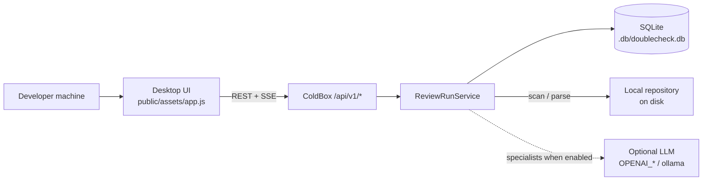
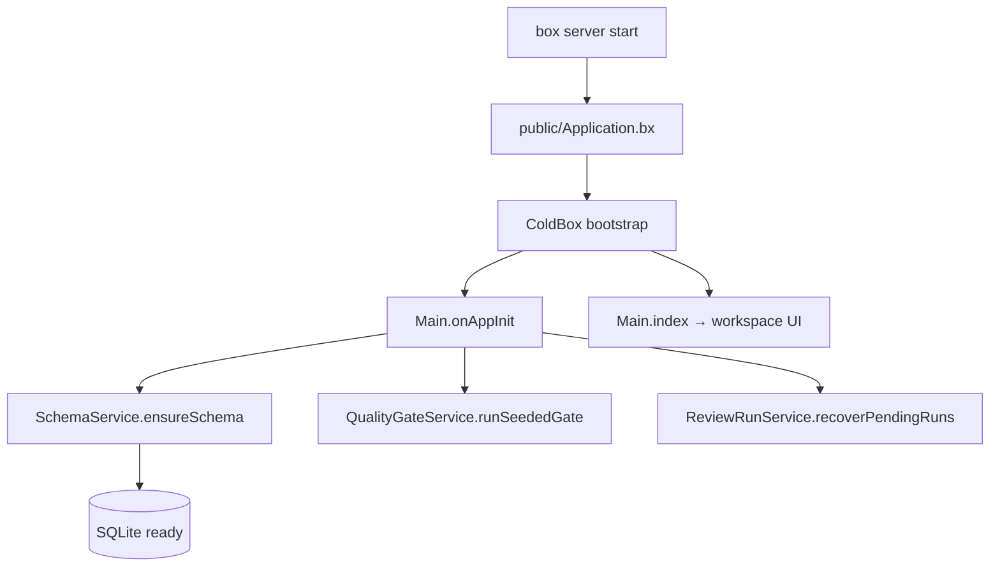
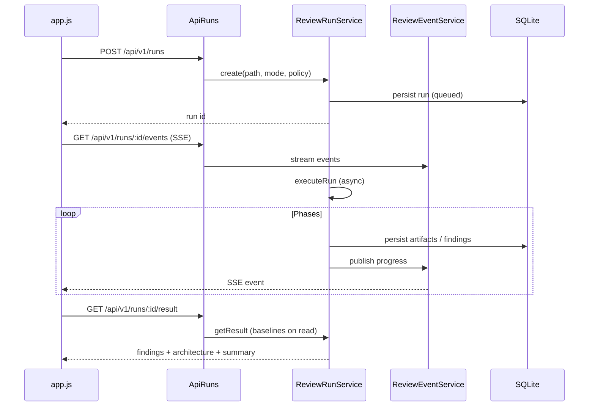
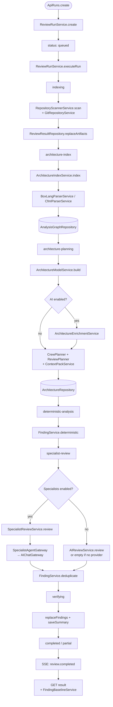
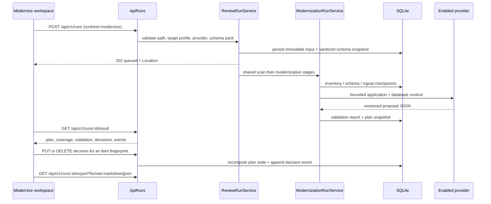
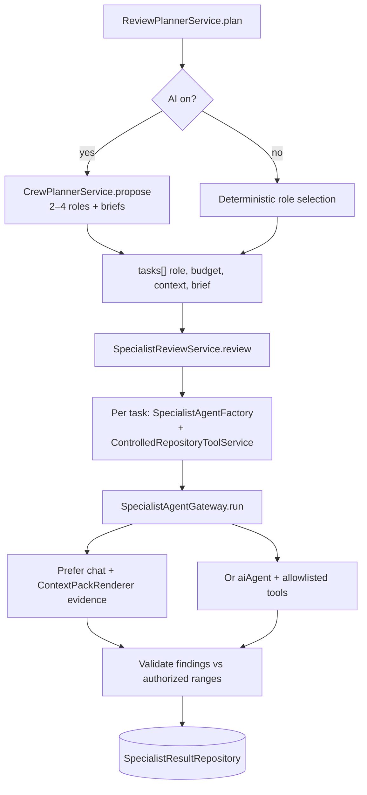
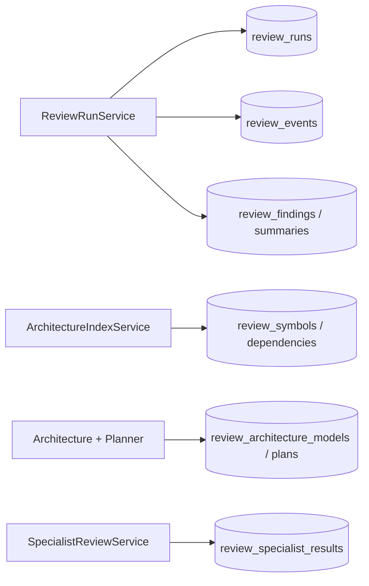

# DoubleCheck — technical implementation & project flow

Local desktop review and modernization helper for **BoxLang, ColdFusion, and
JavaScript**. Analysis and SQLite run on the developer’s machine.
LLM specialists are optional for Review; Modernize requires an enabled provider.
CodeGraph runs without AI for structure; the Domain lens (meaning) requires a
provider.
Source-backed acceptance corpora live under `resources/evaluation-corpus/`:
`codegraph-v1` (`CodeGraphCorpusSpec`) scores route/table flows, bounded paths,
and repeated-run label stability without promoting a language tier;
`modernization-v1` (`ModernizationCorpusSpec`) scores derived boundaries against
`step6-thresholds.json`.

This document describes how the system is wired. Install and product summary live in
[`readme.md`](../../readme.md). Purpose and shipped features (Review vs Modernize)
live in [`application-features.md`](application-features.md). OpenAPI lives under
[`resources/apidocs/`](../apidocs/). Service ownership details live in
[`app/models/README.md`](../../app/models/README.md).

---

## Product summary

DoubleCheck is a local desktop code review assistant for BoxLang, ColdFusion,
and JavaScript. It uses Git to scope reviews (`working-tree`,
`revision-diff`, or `full`), indexes source files, runs deterministic checks
without an AI key, and optionally sends bounded context to configurable LLM
specialist agents with read-only tools. It produces structured, line-level
findings with evidence and export to Markdown, JSON, or SARIF. For unfamiliar
codebases or when there is no meaningful diff, **full** mode reviews entire
supported directories on disk.

Git scopes which files to review; the pipeline indexes full source contents, not
unified diff patches.

Supported language extensions are owned by `SupportedLanguageService`
(BoxLang: `bx`/`bxm`/`bxs`; CFML: `cfc`/`cfm`; JavaScript: `js`/`jsx`).

## Core approach

DoubleCheck runs deterministic engineering first — indexing, parsing,
architecture facts, rule-based checks, and evidence validation — then optionally
layers bounded specialist agents on top for deeper semantic review. The agent
proposes; deterministic gates verify. Basic review works without AI; agents
deepen selected areas when configured.

| Layer | Deterministic engineering | Agent / LLM (optional) |
|---|---|---|
| Discovery | Git scoping, file indexing, language filtering | — |
| Structure | BoxLang AST-first parser with regex fallback, CFML parser, bounded JavaScript parser, dependency graph, architecture facts | Optional fact enrichment with citation checks |
| Planning | Role selection, budgets, context packs, policy | Optional crew planner (roles + briefs) |
| Findings | High-confidence rules (secrets, SQL interpolation, …) | Semantic review by specialist role |
| Trust | Evidence must match indexed source; authorized spans; fingerprints | Proposes candidates; must pass deterministic validation |

---

## Mental model

```text
Browser UI (public/assets/app.js)
        │  REST + SSE
        ▼
ColdBox handlers (app/handlers/Api*.bx)
        │
        ▼
ReviewRunService          ← orchestrates one run end-to-end
        │
        ├─ ModernizationRunService (when runKind=modernize)
        │    ├─ inventory / schema / evidence / signals / coverage
        │    ├─ ModernizationContextPack + proposal / validation / roadmap
        │    └─ ModernizationRepository (plans, checkpoints, decisions)
        ├─ RepositoryScannerService / GitRepositoryService
        ├─ ArchitectureIndexService
        │    → BoxLangParserService / CfmlParserService / JavaScriptParserService → graph DB
        ├─ CodeGraphRunService (routes/resources, roles, flows, reachability, paths)
        ├─ ArchitectureModelService (+ optional Enrichment)
        ├─ CrewPlannerService (LLM roles + briefs when AI on)
        ├─ ReviewPlannerService + ContextPackService
        ├─ FindingService (deterministic)
        ├─ FindingSolutionService + RulePlaybookCatalog
        ├─ SpecialistReviewService → SpecialistAgentGateway → AIChatGateway
        ├─ AIReviewService (fallback if specialists off)
        └─ FindingBaselineService (compare to prior run on read)
        │
        ▼
Repositories (SQLite under DOUBLECHECK_DB_PATH)
        │
        ▼
SSE events (ReviewEventService) → UI live panel
```

**Rule of thumb:** handlers stay thin; review logic lives under
`app/models/services/`. Persistence is `app/models/repositories/`.

---

## System context



---

## Bootstrap & layout

| Step | Where |
|---|---|
| Web root | `public/` → `public/Application.bx` maps `/app` |
| App shield | `app/Application.bx` is `abort;` (blocks direct web access to `/app`) |
| ColdBox config | `app/config/ColdBox.bx` (settings from `.env`) |
| Routes | `app/config/Router.bx` |
| App start | `Main.onAppInit` → `SchemaService.ensureSchema()`, quality gate, recover pending runs |
| Setup CLI | `Setup.bx` creates `.env` only when missing (does not create the DB) |
| UI page | `Main.index` → `app/views/main/index.bxm` + `public/assets/app.js` / `app.css` |



### Folder map

```text
app/
  handlers/           HTTP adapters (ApiRuns, ApiHealth, …)
  models/
    services/         Business logic (start here for features)
    repositories/     SQLite access
    domain/           Small domain objects
  views/              Server-rendered UI shells
  config/             ColdBox + Router
  modules/aiFlight/   Optional bx-ai trace explorer (separate DB)
public/
  assets/app.js       Workspace UI + SSE client
  assets/app.css
resources/
  apidocs/            OpenAPI source
  docs/               This documentation
tests/specs/          TestBox (unit + integration)
```

---

## HTTP surface

Defined in `app/config/Router.bx`. Full contract: [`resources/apidocs/openapi.yaml`](../apidocs/openapi.yaml).

### Core

| Method | Path | Handler | Role |
|---|---|---|---|
| GET | `/api/v1/health` | ApiHealth | Liveness |
| GET | `/api/v1/capabilities` | ApiCapabilities | Feature flags for UI |
| GET | `/api/v1/openapi` | ApiOpenApi | Generated contract as JSON |
| GET | `/api/v1/openapi.yaml` | ApiOpenApi | Generated contract as YAML |
| GET | `/api/v1/session` | ApiSession | Local session / principal |
| GET | `/api/v1/projects` | ApiProjects | Local project list |
| GET | `/api/v1/projects/tree` | ApiProjects | Project path tree |
| GET | `/api/v1/codegraph` | ApiCodeGraph | Newest usable CodeGraph snapshot for a project path |
| GET | `/api/v1/workers` | ApiWorkers | Worker registry |
| GET | `/api/v1/quality` | ApiQuality | Seeded evaluation gate |
| GET | `/api/v1/history` | ApiHistory | Review + Modernize + CodeGraph history (`runKind` filter) |
| GET | `/api/v1/history/:id/comparison` | ApiHistory | Fingerprint comparison vs prior run |
| GET/POST | `/api/v1/runs` | ApiRuns | List / **create run** |
| GET/DELETE | `/api/v1/runs/:id` | ApiRuns | Status / cancel |
| GET | `/api/v1/runs/:id/result` | ApiRuns | Final payload |
| GET | `/api/v1/runs/:id/export` | ApiRuns | Review/Modernize: Markdown / JSON / SARIF; CodeGraph: Markdown / JSON / Mermaid / SVG |
| POST | `/api/v1/runs/:id/rerun` | ApiRuns | Rerun from prior input |
| POST | `/api/v1/runs/:id/follow-up` | ApiRuns | Review-only follow-up |
| PUT | `/api/v1/runs/:id/findings/:fingerprint/review` | ApiRuns | Finding decision overlay |

### Observability

| Method | Path | Handler | Role |
|---|---|---|---|
| GET | `/api/v1/runs/:id/events` | ApiRuns | **SSE** progress stream |
| GET | `/api/v1/runs/:id/event-log` | ApiRuns | Ordered event log |
| GET | `/api/v1/runs/:id/traces` | ApiRuns | Local Langfuse-style traces |

### Modernize

| Method | Path | Handler | Role |
|---|---|---|---|
| PUT/DELETE | `/api/v1/runs/:id/modernization/items/:itemId/decision` | ApiRuns | Accept, reject, or clear a Modernize decision |
| POST | `/api/v1/runs/:id/modernization/continue` | ApiRuns | Continue a partial modernize run |
| POST | `/api/v1/runs/:id/modernization/phases/:phaseId/rebuild` | ApiRuns | Rebuild one roadmap phase |
| POST | `/api/v1/runs/:id/modernization/items/:itemId/rebuild` | ApiRuns | Rebuild one plan item |

### CodeGraph

| Method | Path | Handler | Role |
|---|---|---|---|
| GET | `/api/v1/runs/:id/codegraph/subgraph` | ApiCodeGraph | Neighbourhood drill-down (`focus`, `depth`, `limit`) |
| GET | `/api/v1/runs/:id/codegraph/edges` | ApiCodeGraph | Bounded file edges, optional cluster/kind filter |
| GET | `/api/v1/runs/:id/codegraph/paths` | ApiCodeGraph | Bounded directed/reverse/any paths with hop evidence |
| GET | `/api/v1/runs/:id/codegraph/graph` | ApiCodeGraph | One level of the stored graph (`level`, `scope`, `rank`, `limit`); 409 when the snapshot predates levelled storage |
| GET | `/api/v1/runs/:id/codegraph/search` | ApiCodeGraph | Server-side node search across every level, including symbols the canvas never drew |
| GET | `/api/v1/runs/:id/codegraph/source` | ApiCodeGraph | Cited local source excerpt, bounded to the indexed run root |
| POST | `/api/v1/runs/:id/codegraph/narrative` | ApiCodeGraph | Retry optional CodeGraph meaning layer |
| PUT/DELETE | `/api/v1/runs/:id/codegraph/label` | ApiCodeGraph | Persist or clear a local user module label |

Query surface over the levelled rows (all `ApiCodeGraph`, all served from
`CodeGraphQueryRepository` unless noted; 409 when the snapshot predates levelled
storage):

| Method | Path | Role |
|---|---|---|
| GET | `/api/v1/runs/:id/codegraph/neighbours` | What reaches a node and what it reaches (`node`, `direction`, `limit`) |
| GET | `/api/v1/runs/:id/codegraph/references` | Every occurrence of a symbol name with its definitions, each marked `bound` or `unresolved` |
| GET | `/api/v1/runs/:id/codegraph/hierarchy` | What a node extends/implements and what does so to it |
| GET | `/api/v1/runs/:id/codegraph/lineage` | Readers and writers of one `table` |
| GET | `/api/v1/runs/:id/codegraph/impact` | Depth-bounded transitive callers (`node`, `depth` 1–6, `limit`) |
| GET | `/api/v1/runs/:id/codegraph/onboarding` | Ranked starting points with a reason each |
| GET | `/api/v1/runs/:id/codegraph/diff` | Node/edge deltas against a `base` run; 409 when the base has no levelled graph |
| GET | `/api/v1/runs/:id/codegraph/rules` | `ArchitectureRuleService` over the file level, with per-violation evidence — reporting, never a gate |
| GET | `/api/v1/runs/:id/codegraph/mcp` | The same surface described as MCP tools + contract (`CodeGraphMcpDescriptor`) |

### Providers & settings

| Method | Path | Handler | Role |
|---|---|---|---|
| GET | `/api/v1/ai/smoke` | ApiAI | Env-based provider smoke test |
| GET/POST | `/api/v1/ai-providers` | ApiAIProviders | List / create provider profiles |
| GET/PUT/DELETE | `/api/v1/ai-providers/:id` | ApiAIProviders | Profile CRUD |
| POST | `/api/v1/ai-providers/:id/activate` | ApiAIProviders | Set active profile |
| POST | `/api/v1/ai-providers/:id/smoke` | ApiAIProviders | Profile smoke test |
| GET/PUT | `/api/v1/app-settings` | ApiAppSettings | Local app setting overrides |

### UI routes

| Method | Path | Handler | Role |
|---|---|---|---|
| GET | `/review` | Main | Review workspace page |
| GET | `/modernize` | Main | Modernize workspace page |
| GET | `/codegraph` | Main | CodeGraph workspace page |
| — | `/aiflight` | aiFlight module | Optional bx-ai trace explorer |

UI create path: `app.js` → `POST /api/v1/runs` → open SSE on `/events`.

`runKind=modernize` keeps the same queue, lease, cancellation, SSE, and result
routes, then branches after the shared scan into `ModernizationRunService`.

`runKind=codegraph` follows the same pattern into `CodeGraphRunService`
(parser-compatible Review graph adoption when available → index fallback →
metrics/clusters/roles/flows → persist structure → levelled row projection →
optional narrative v2 → update narrative). Export is local through
`ReportExportService` (delegating to `CodeGraphDiagramService`); Markdown and
JSON carry the snapshot, Mermaid renders a bounded flow, and SVG renders a
bounded node canvas.



---

## One CodeGraph run

CodeGraph is a separate run kind on the same local run queue. It builds a
deterministic CF/BoxLang/JavaScript knowledge-graph snapshot (nodes with `role`, clusters,
handler/browser-seeded `flows[]`, issues) and optionally asks an LLM for a Domain lens
briefing. Unlike Modernize, the run is **not** provider-gated — no key still
yields complete structure; the UI shows a meaning banner when narrative is absent.

Phases after the shared scan:

| % | phase | event |
|---|---|---|
| 20 | `codegraph-index` | `codegraph.index` |
| 40 | `codegraph-metrics` | `codegraph.metrics` |
| 60 | `codegraph-clusters` | `codegraph.clusters` |
| 75 | `codegraph-narrative` | `codegraph.narrative` |
| 90 | `codegraph-persist` | — |
| 100 | `completed` | `codegraph.completed` |

Services: `CodeGraphRunService` (pipeline; structure is persisted before optional meaning), `CodeGraphInventoryAdapter` +
`CodeGraphMetricsService` (deterministic snapshot — roles on nodes, routes/resources,
reachability, bounded co-change/churn; reuses `ModernizationCouplingGraphService` /
`ModernizationDerivedStructureService`), `CodeGraphFlowService` (reachability and
handler/browser-seeded `flows[]`, one flow per (entry, sink) with its terminal
named), `CodeGraphCentralityService` (rank), `CodeGraphCompletenessService`
(every capped collection reports `{ returned, available, omitted, rankedBy,
complete, state }` plus run-level `unresolved` / `unsupported`),
`SyntheticNodeBuilder` (resource and knowledge nodes),
`CodeGraphProjectionService` + `CodeGraphLevelProjector` (levelled rows),
`CodeGraphQueryService` (subgraph, file edges, bounded paths, source windows),
`CodeGraphDiagramService` (Mermaid/SVG), `CodeGraphMcpDescriptor` (agent tool
descriptions), `CodeGraphNarrativeService` (optional
Domain lens via `codegraph-narrative-v2`: pitch, domains, processes, onboarding,
risk + backward-compatible summaries; soft-fails without mutating snapshot),
`CodeGraphRepository` (SQLite `codegraph_snapshots`, per-cluster
`codegraph_narrative_shards`, and project-scoped `codegraph_labels`),
`CodeGraphGraphRepository` (levelled `codegraph_nodes` / `codegraph_edges` reads
and writes) and `CodeGraphQueryRepository` (the neighbours / references /
hierarchy / lineage / impact / onboarding / diff queries over those rows). Narrative
shards are keyed by stable member composition plus cluster fingerprint; labels
survive runs but a bounded startup sweep removes rows for missing local project
paths. Payload paths are project-relative before optional provider egress, and
the narrative reports section coverage and trimmed sections.

Result payload lives under `data.result.codegraph` via `CodeGraphRunService.getResult()`
(nodes, clusters, directories, `flows[]`, hotspots, cycles, orphans,
layer violations, narrative — **no** raw edge list; `flows` default `[]` when
absent from snapshot). Subgraph drill-down:
`GET /api/v1/runs/:id/codegraph/subgraph`. File edges:
`GET /api/v1/runs/:id/codegraph/edges`; bounded paths:
`GET /api/v1/runs/:id/codegraph/paths`. The explorer offers cluster, layer,
swimlane, and radial layouts. Cited-edge source windows use
`GET /api/v1/runs/:id/codegraph/source`; paths are repository-relative,
size/line bounded, and source text is not persisted. Everything the payload does
not carry — neighbours, references, hierarchy, lineage, impact, onboarding,
diff, rules — is a query against the levelled rows (see the CodeGraph query
surface table above), which is also what the drawer's Trace and Assess tabs
call. Git history remains local and degrades to structural-only when
unavailable.

---

## One review run (pipeline)

**Entry:** `ApiRuns.create` → `ReviewRunService.create` → async
`ReviewRunService.executeRun`.

Modes: `full` (default), `working-tree`, `revision-diff`.

### Phase table

| Phase | Service(s) | What happens |
|---|---|---|
| `indexing` | `RepositoryScannerService`, `GitRepositoryService` | Discover files for the selected mode; **skip counts** (`oversized`, `limit`, …) and `discoveryTruncated` persist on the run result, UI, export, and coverage assessment |
| `architecture-index` | `ArchitectureIndexService`, `BoxLangParserService`, `CfmlParserService`, `JavaScriptParserService` | Build symbol/dependency graph for supported BoxLang, CFML, and JavaScript sources |
| `architecture-planning` | `ArchitectureModelService`, enrichment/diff, `CrewPlannerService`, `ReviewPlannerService`, `ContextPackService` | Architecture facts + plan + context budgets; deterministic roles get **`emphasizeFiles`** without LLM; context packs prefer **changed-line** ranges when Git supplies them (`symbol-range-artifact-refs-v3`) |
| `deterministic-analysis` | `FindingService.deterministic` | **Language-scoped** rule packs (shared, JavaScript, CFML/BoxLang); no AI key required |
| `specialist-review` | `SpecialistReviewService` → gateway → chat; or `AIReviewService` fallback | Optional LLM deepening |
| `verifying` | `ReviewResultRepository` | Persist findings + summary + fingerprints |
| `completed` | `FindingBaselineService` (on **read**) | Result API attaches new/unchanged/fixed vs prior run |

Cancel: `DELETE /api/v1/runs/:id` sets a cancel flag; `executeRun` checks between phases.

### Review focus & coverage honesty

| Area | Behavior |
|---|---|
| **Language-scoped rules** | `FindingService.deterministic` applies packs by file `language`: shared rules (secrets, open markers) on all supported languages; `execution/dynamic-code` on JavaScript only; `database/query-interpolation` and CF-style empty-catch on CFML/BoxLang; JS empty-catch on JavaScript. Additional CFML-only rules (lifecycle gaps, queryparam, unscoped vars, dynamic includes, deprecated `cflock` scopes) run for CFML files. |
| **Skip / truncation persistence** | `RepositoryScannerService` returns `skipped` counts and `discoveryTruncated`; `ReviewRunService` stores them on the result (`skipped_json`, `discovery_truncated`). The UI, `ReportExportService`, and `CoverageAssessmentService` surface honest coverage notes when files were skipped or discovery hit a budget. |
| **Deterministic `emphasizeFiles`** | When LLM crew planning is off, `ReviewPlannerService.emphasizeFilesForRole` picks up to eight paths per role (convention, security, testing heuristics). `contextFilesForSelection()` already boosts emphasized paths in context packs. |
| **Changed-line context packs** | `GitRepositoryService.changedLineRanges` feeds `changedLines` on indexed files; `ContextPackService` ranks `changed-line` candidates first. Context version is **`symbol-range-artifact-refs-v3`** (capabilities + fingerprints). This preference only applies to files already in `ContextPackService.wantedPaths` — today driven by the architecture graph (changed symbols, impacts, dependencies) plus any file that itself carries `changedLines`. A changed non-graph file with no `changedLines` of its own can still be omitted from the pack when graph symbols dominate the wanted set. |
| **Specialist prompt v5** | `SpecialistAgentFactory` uses `specialist-prompt-v5`. CFML conventions get equal-weight defects + incremental modernization assist (never assume ColdBox; not a rewrite). BoxLang conventions stay framework-contract focused. Other roles do not receive CF modernization paragraphs. Capabilities label: `specialistCfmlDepth=cfml-conventions-llm-v2`. |
| **Deterministic convention briefs** | When LLM crew planning is off, `ReviewPlannerService.briefForRole` fills `cfml-conventions` / `boxlang-conventions` briefs with up to five matching paths (preferring `changedLines`) plus a short reminder. |
| **Emphasized CF/BX packs** | Emphasized admissions for convention roles prefer files with `changedLines` and build ranges around those windows (same before/after/`maxLinesPerRange` clamps as context packs), falling back to the file head only when Git supplies no changed lines. |
| **CF guidance playbooks** | `RulePlaybookCatalog` includes small `modernization/…` and `cfml/evaluate-dynamic` playbooks for specialist ruleIds. The first-class CF Modernize workspace is described below and remains proposal-only (no source or DDL writes). |

Scan defaults were raised for typical repos (`DOUBLECHECK_SCAN_MAX_FILE_BYTES=524288`,
`DOUBLECHECK_SCAN_MAX_BYTES=10485760`) so more source is indexed before skip gates apply.

### Technical flow (Mermaid)



---

## One Modernize run (CFML workspace)

Modernize is a separate run kind on the same local run queue. It proposes and
validates a migration plan; it does not rewrite application files, execute DDL,
or guarantee runtime parity. Basic Review remains available without an AI key.
Modernize requires an enabled LLM provider, including keyless local Ollama or
Docker providers. When a remote provider is selected, the UI requires an
explicit egress acknowledgement; only bounded, redacted context leaves the
machine.

Pipeline contract: **`modernization-pipeline-v9`** (`ModernizationRunService`).
Full service list: [`app/models/README.md`](../../app/models/README.md) (Modernize workflow).
Live plan: [`plans/modernize-inversion-plan.md`](plans/modernize-inversion-plan.md)
(its Part 0 ledger is the answer to "what is done?").

**Structure is derived, then judged.** Clusters and migration order come from a
computed coupling graph before any model call, so the model argues with a fixed
structure rather than inventing one. The `modernization-architecture` and
`modernization-repair` roles are gone with the repair round: an invalid item is a
bug in derivation, not a prompt to retry. Agent roles are `modernization-`
`application` / `database` / `roadmap` / `rebuild` / `judge` / `narrate` /
`critic` / `brief` (`ModernizationAgentFactory`, `modernization-prompt-v6`).

### Stages after shared scan

| % | Stage | Service(s) | What happens |
|---|---|---|---|
| 25 | Inventory | `ModernizationInventoryService` | Catalog CFML units and legacy evidence; no CFML scope fails the run |
| 35 | Schema | `ModernizationSchemaPackService` | Sanitize optional schema evidence (no DDL execution) |
| 42 | Evidence / signals | `ModernizationEvidenceDiscoveryService`, `ModernizationSignalService` | Allowlisted config/migration evidence + coupling signals, rolled up onto units |
| 46 | Graph | `ModernizationCouplingGraphService` | Deterministic coupling graph, no provider |
| 50 | Derived | `ModernizationDerivedStructureService` | `modernization-derived-v1`: clusters + wave order, before the context pack so shards have something to shard against |
| — | Coverage / context | `ModernizationCoverageService`, `ModernizationContextPackService` | Honest coverage + bounded context partitions |
| 58 | Proposal | `ModernizationProposalService` (+ `ModernizationRoadmapShardService` / `ModernizationRoadmapSynthesisService`) | Sharded application maps, then database and roadmap proposals |
| 78 | Judge | `ModernizationJudgementService` | Model verdicts on the derived boundaries + capability naming; provider-only, contained — a failure keeps the derived structure |
| 82 | Validation | `ModernizationValidationService` | Structure, evidence, and safety gates over the placed plan |
| 84 / 86 | Critic / brief | `ModernizationJudgementService` | Architecture critique, then the verdict. Neither may change the plan; provider-only |
| 94 | Roadmap / plan | `ModernizationRunService` | Assemble the bounded roadmap into the versioned plan snapshot + decisions |
| — | Continue / rebuild | continue + `ModernizationSliceRebuildService` | Continue partial runs; rebuild one phase or item without widening scope |

The accepted artifact is persisted (`state: needs-review`) before the
cancellation boundary, so an interruption can leave gates open but cannot discard
accepted fragments.



Modernize checkpoints are reusable only when the immutable input, source
fingerprints, and pipeline contract version match. A rerun creates a new run and
snapshot; a prior decision is carried forward only when the item type, stable ID,
and item fingerprint are identical. Finding baselines and `follow-up` remain
Review-only.

Provider lifecycle observations are persisted as redacted local trace events
with modernization role and phase labels. Prompts and raw provider responses are
not stored in the plan, event stream, or export.

The result workspace keeps coverage banners visible when the repository scan is
truncated or schema evidence is absent, and labels missing schema coverage as
inference-limited rather than presenting inferred database changes as facts.

---

## Specialist path (when AI is configured)



Config knobs (`.env` / `ColdBox.bx`): `OPENAI_API_BASE`, `OPENAI_API_KEY`,
`DEFAULT_MODEL`, `AI_CONTEXT_WINDOW`, timeouts and budgets.

Scan defaults (`DOUBLECHECK_SCAN_MAX_FILE_BYTES`, `DOUBLECHECK_SCAN_MAX_BYTES`,
`DOUBLECHECK_SCAN_MAX_FILES`) gate indexing volume separately from specialist
context packs (`DOUBLECHECK_PLAN_MAX_CONTEXT_CHARACTERS`, `AI_CONTEXT_WINDOW`).
When limits bite, skip counts appear on the result rather than silently dropping
files. Raise scan limits to index more source for deterministic rules; raise
plan/token knobs if prompts hit context errors.

### With vs without an AI key

| Setup | Review works? | What you get |
|---|---|---|
| **No** AI key | Yes | Deterministic findings; BoxLang/CFML graph/architecture when those sources exist |
| **With** key (or `ollama` / `docker` provider) | Yes | Same baseline + crew planner + specialist agents |

A key is never required for a basic local review.

---

## Data layer

- **Path:** `DOUBLECHECK_DB_PATH` (default `./.db/doublecheck.db`)
- **Datasource:** `doublecheck`
- **Schema:** `SchemaService` owns create/repair/rebuild (no `resources/database/migrations/`)

### Persistence map



Modernize adds durable snapshots beside the Review records:
`modernization_schema_packs` stores sanitized schema evidence by fingerprint,
`modernization_checkpoints` stores stage artifacts, `modernization_plans` stores
the versioned proposal/validation snapshot, and `modernization_decisions` plus
`modernization_decision_events` store the current human decision state and its
audit trail. Inline schema text and provider credentials are never retained in
raw form.

CodeGraph persists one blob per run in `codegraph_snapshots` (snapshot JSON,
fingerprint, truncation flags, optional `narrative_cache_key` /
`narrative_json` for cross-run narrative reuse). Edges remain in
`review_dependencies` — not duplicated into the snapshot blob.

Alongside the blob, `CodeGraphProjectionService` writes the same run into
`codegraph_nodes` and `codegraph_edges` at six levels — `cluster`, `directory`,
`file`, `symbol`, plus `resource` (routes, tables, config keys, events,
outbound integrations, with their participants) and `knowledge` (LLM domains,
processes and risks joined to structure by `describes` / `affects` edges, always
marked `resolution: narrative`, `provenance: llm` — never evidence) — linked by
`parent_id`, with `codegraph_node_search` backing name lookup. The blob is what
the canvas draws; the rows are what `/codegraph/graph`, `/codegraph/search` and
the whole query surface read, so drilling and searching reach nodes the canvas
never received. Rows are
written **after** the structure save, so time-to-first-map does not pay for
them; a projection failure leaves the snapshot usable and is reported on the run
event stream rather than swallowed.

Symbol-level fidelity comes from `review_dependencies.source_symbol_id` /
`source_symbol`, filled during indexing by interval containment: the innermost
symbol whose `[line, end_line]` body encloses the dependency's line. Empty means
the dependency sits outside any symbol body, and callers render "file level"
rather than guessing. Because this is derived in `materialize`, downstream of
parsing, `ArchitectureIndexService.indexVersion` participates in the graph
adoption signature — otherwise a run would adopt pre-attribution rows and serve
the old shape.

AI API keys are **not** stored in SQLite (environment only). Provider profiles
may store connection settings via `AIProviderProfileRepository`; secrets stay
out of exports and traces.

---

## UI responsibilities

`public/assets/app.js` drives the desktop workspace:

1. Boot health / session / capabilities
2. Create run → watch SSE + poll status
3. Render findings, architecture explorer, specialist board, baselines, the
   Modernize plan workspace, or the CodeGraph explorer
   (`public/assets/codegraph-layout.js` UMD for layout/SVG math)
4. History, rerun/follow-up (Review-only), cancel, export, finding/plan decisions

Screenshots: [images/01-workspace.png](images/01-workspace.png),
[images/02-findings.png](images/02-findings.png),
[images/03-architecture.png](images/03-architecture.png),
[images/04-observability.png](images/04-observability.png).

---

## Related modules

**aiFlight** (`app/modules/aiFlight/`) — local Langfuse-style explorer for bx-ai
interceptor events. Uses its own SQLite DB and the `/aiflight` route. It is **not**
part of the review pipeline; run-level observability uses `ObservabilityTraceService`
and `/api/v1/runs/:id/traces`.

---

## Services cheat sheet

Full ownership tables: [`app/models/README.md`](../../app/models/README.md).

| Want to change… | Open… |
|---|---|
| Run lifecycle / phases | `ReviewRunService` |
| File discovery / Git modes | `RepositoryScannerService`, `GitRepositoryService`, `SupportedLanguageService` |
| BoxLang / CFML parse graph | `ArchitectureIndexService`, `BoxLangParserService`, `CfmlParserService` |
| Architecture / plan / context | `ArchitectureModelService`, `CrewPlannerService`, `ReviewPlannerService`, `ContextPackService` |
| Deterministic rules | `FindingService` |
| Playbooks / fix patches | `FindingSolutionService`, `RulePlaybookCatalog` |
| Specialist prompts / roles | `SpecialistAgentFactory` |
| LLM calls | `SpecialistAgentGateway`, `AIChatGateway` |
| Tool allowlist / redaction | `ControlledRepositoryToolService` |
| Modernize pipeline | `ModernizationRunService` (+ services in models README) |
| Modernize derived structure | `ModernizationCouplingGraphService`, `ModernizationDerivedStructureService`, `ModernizationPlacementService` |
| Modernize model commentary | `ModernizationJudgementService` (judge / narrate / critic / brief), `ModernizationAgentFactory` |
| CodeGraph pipeline | `CodeGraphRunService`, `CodeGraphMetricsService`, `CodeGraphFlowService`, `CodeGraphNarrativeService` |
| CodeGraph levelled rows | `CodeGraphProjectionService`, `CodeGraphLevelProjector`, `SyntheticNodeBuilder`, `CodeGraphGraphRepository` |
| CodeGraph query endpoints | `CodeGraphQueryRepository` (neighbours / references / hierarchy / lineage / impact / onboarding / diff), `CodeGraphQueryService` (subgraph / edges / paths / source) |
| CodeGraph caps & honesty | `CodeGraphCompletenessService`, `CodeGraphCentralityService` |
| Agent (MCP) description | `CodeGraphMcpDescriptor` |
| Baselines | `FindingBaselineService` |
| Export formats | `ReportExportService` / `ModernizationExportService` |
| Path allowlist / security | `SecurityContextService` |

---

## Suggested reading order

1. [`readme.md`](../../readme.md) — install / product summary  
2. **This file** — technical flow + diagrams  
3. [`app/models/README.md`](../../app/models/README.md) — service / repository ownership  
4. `app/models/services/ReviewRunService.bx` — one vertical slice (`executeRun`)  
5. `public/assets/app.js` — create run + SSE handling  
6. [`resources/apidocs/openapi.yaml`](../apidocs/openapi.yaml) — API contract  
